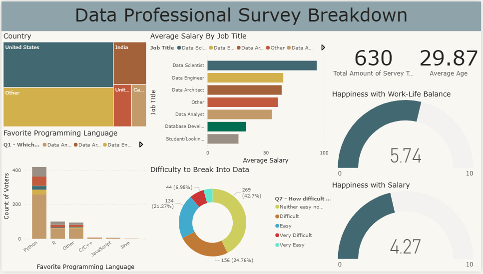

# Data Professional Survey Dashboard (Power BI)

## Overview
This project analyzes survey data from data professionals to uncover insights about salaries, job roles, programming languages, and job satisfaction.

The goal was to transform raw survey data into a clean, structured format and build an interactive dashboard that delivers meaningful and actionable insights.

---

## Business Questions
- Which job roles earn the highest salaries?
- What programming languages are most popular among data professionals?
- How satisfied are professionals with their salary and work-life balance?
- Is there a gender pay gap in the data industry?
- How difficult is it to break into the data field?

---

## Dataset

The dataset contains survey responses from data professionals, including:

- Job titles (Data Analyst, Data Scientist, Data Engineer, etc.)
- Salary information
- Favorite programming languages
- Work-life balance ratings
- Salary satisfaction
- Gender distribution
- Perceived difficulty of entering the data field

The data was originally provided in Excel format and required cleaning and transformation before analysis.

---

## Process

### 1. Data Preparation
- Imported raw data from Excel into Power BI
- Transformed data using Power Query Editor
- Split columns to improve data usability for analysis

### 2. Data Transformation
- Created calculated columns using DAX
- Built an average salary column
- Structured and aggregated data for analysis

### 3. Data Analysis
- Analyzed survey responses across:
  - Job roles
  - Salary distribution
  - Programming languages
  - Work-life balance
  - Salary satisfaction
- Identified patterns and trends in the dataset

### 4. Data Visualization
- Built an interactive dashboard in Power BI
- Designed visuals for:
  - Salary comparison by job title
  - Programming language popularity
  - Work-life balance satisfaction
  - Gender pay gap analysis
- Improved dashboard readability through formatting and layout optimization

---

## Data Cleaning

During preprocessing, the following steps were performed:

- Removed inconsistencies in categorical values
- Split columns containing multiple values
- Handled missing and null values
- Standardized column formats
- Created new calculated columns using DAX (e.g., Average Salary)

This step ensured the accuracy and reliability of the analysis.

---

## Key Insights
- Data Scientists and Data Engineers tend to have the highest salaries
- Python is the most widely used programming language
- Work-life balance is generally rated positively
- A gender pay gap is present in some roles
- Many respondents find it difficult to break into the data field

---

## Key Metrics
- Total Survey Responses: 630
- Average Age: 29.87

---

## Tools & Technologies
- Power BI
- Power Query
- DAX (Data Analysis Expressions)
- Excel

---

## Dashboard Preview

---

## How to Use
1. Download the `.pbix` file from the repository
2. Open it in Power BI Desktop
3. Explore the interactive dashboard
